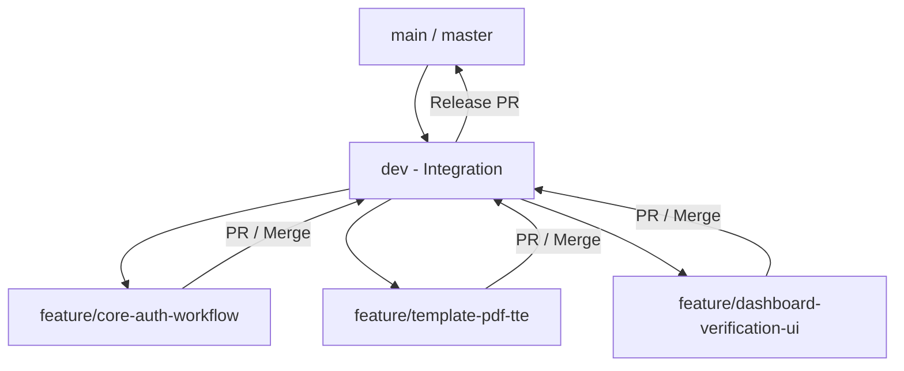

# Panduan Pembagian Tugas & Strategi Git Branching (Tim 3 Orang)

Panduan ini mengatur pembagian tugas dan strategi pengabangan (branching) untuk proyek **SIP-SK-Utara** (Sistem Informasi Pembuatan Surat Keputusan Produk Hukum Kecamatan Pekalongan Utara) berbasis PRD v2.0.

---

## 1. Strategi Branching (Git Flow)

- `main` : Branch produksi / stable release. *Jangan commit langsung ke main.*
- `dev` : Branch integrasi utama tempat penggabungan fitur-fitur dari anggota tim sebelum rilis.
- `feature/*` : Branch khusus untuk tiap fitur yang dikerjakan anggota tim.



---

## 2. Pembagian Tugas 3 Anggota Tim

### 🧑‍💻 Developer 1: Backend Core, RBAC & Workflow Engine
**Branch Utama**: `feature/core-auth-workflow`
**Tanggung Jawab Utama**:
1. **Database & Migrasi**:
   - Menulis migrasi database (`users`, `sk_templates`, `sk_submissions`, `sk_logs`).
2. **Autentikasi & RBAC (Spatie Laravel-Permission)**:
   - Membuat Seeder Peran (`RoleAndPermissionSeeder`): *Admin Kelurahan, Admin Kecamatan, Bagian Hukum (Setda), Camat*.
   - Membuat User Dummy Seeder untuk 4 role tersebut.
   - Mengatur middleware rute & hak akses controller.
3. **Workflow Lifecycle Engine (`SkWorkflowService`)**:
   - Mengelola state machine perubahan status permohonan SK:
     - `DRAFT_KELURAHAN` -> `REVIEW_KECAMATAN` -> `REVIEW_HUKUM` -> `READY_FOR_APPROVAL` -> `APPROVED` / `REJECTED`.
   - Pencatatan otomatis **Audit Trail Log** ke tabel `sk_logs` pada setiap aksi status.

---

### 🧑‍💻 Developer 2: Engine Template Dinamis, PDF & TTE QR Code
**Branch Utama**: `feature/template-pdf-tte`
**Tanggung Jawab Utama**:
1. **Dynamic SK Template Engine**:
   - CRUD Template SK di `SkTemplateController`.
   - Menangani struktur schema JSON `dynamic_fields` (misal: `[{"name": "nama_ketua", "label": "Nama Ketua", "type": "text"}]`).
   - HTML Parser Engine untuk merender variabel `{{nama_ketua}}` ke template Blade.
2. **PDF Generation Engine (`SkPdfService`)**:
   - Integrasi `barryvdh/laravel-dompdf` untuk konversi Blade HTML ke PDF ukuran A4.
3. **TTE QR Code & Hash Security**:
   - Integrasi `simplesoftwareio/simple-qrcode`.
   - Penjanaan String Hash SHA-256 (kombinasi ID, Nomor SK, & Timestamp).
   - Menyisipkan QR Code yang mengarah ke URL Publik (`/verify-sk/{hash}`) tepat di atas kolom Tanda Tangan Camat di PDF.

---

### 🧑‍💻 Developer 3: Frontend UI, Responsive Dashboard & Portal Verifikasi Publik
**Branch Utama**: `feature/dashboard-verification-ui`
**Tanggung Jawab Utama**:
1. **Layout & Dashboard Admin (Blade + Tailwind CSS + Alpine.js)**:
   - Layouting utama ([app.blade.php](file:///d:/sip-sk-utara/resources/views/layouts/app.blade.php), `navigation.blade.php`).
   - Halaman Dashboard Ringkasan Statistik Status SK.
2. **Form Dynamic Generator UI & Approval Modals**:
   - Interface input dinamis untuk Admin Kelurahan saat membuat draf SK.
   - UI Verifikasi & Form Penomoran SK untuk Bagian Hukum & Camat.
3. **Portal Verifikasi Keaslian Publik (`PublicVerifyController`)**:
   - Halaman publik tanpa login di rute `verify-sk/{hash}`.
   - Menampilkan metadata resmi SK & indikator hijau *"DOKUMEN RESMI TERDAFTAR DI DATABASE KECAMATAN PEKALONGAN UTARA"*.

---

## 3. Workflow Kerja Sehari-hari

1. **Memulai Tugas**:
   ```bash
   git checkout dev
   git pull origin dev
   git checkout feature/<nama-feature-kamu>
   git rebase dev
   ```

2. **Commit & Push**:
   ```bash
   git add .
   git commit -m "feat(module): deskripsi perubahan fitur"
   git push origin feature/<nama-feature-kamu>
   ```

3. **Penggabungan Kode (Pull Request)**:
   - Buka PR di GitHub dari `feature/<nama-feature>` ke `dev`.
   - Minta sekurang-kurangnya 1 rekan tim untuk mereview sebelum di-merge.
   - Setelah semua fitur di `dev` lolos pengujian/UAT, buat PR dari `dev` ke `main`.
